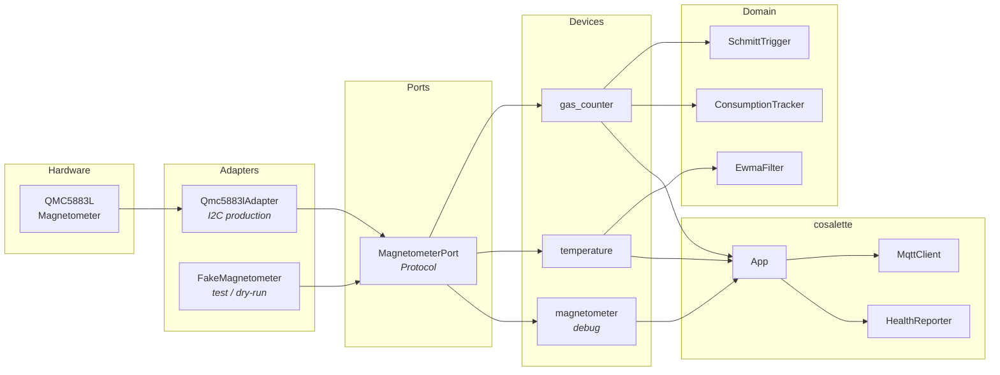
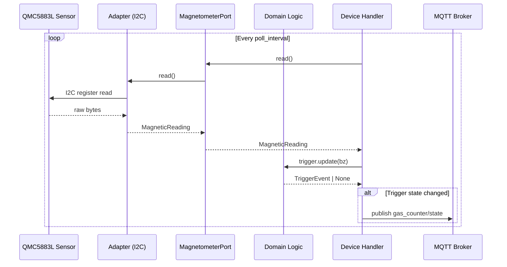

# Architecture

gas2mqtt follows the **Ports & Adapters** (hexagonal) architecture pattern. Domain
logic has zero I/O dependencies — all hardware and network access goes through protocol
boundaries. The [cosalette](https://github.com/ff-fab/cosalette) IoT framework handles
MQTT connectivity, health reporting, error isolation, and graceful shutdown.

---

## Overview

---

## Layers

### Ports

The hardware boundary. Ports are Python `Protocol` classes that define the interface
between domain logic and the outside world.

| Port               | Methods                        | Purpose                    |
| ------------------ | ------------------------------ | -------------------------- |
| `MagnetometerPort` | `read()`, `initialize()`, `close()` | Magnetometer I2C access |

The port returns a `MagneticReading` dataclass with `bx`, `by`, `bz`, and
`temperature_raw` fields. Code that depends on `MagnetometerPort` never touches I2C
directly.

### Adapters

Concrete implementations of ports. Swapped at runtime — production vs. test/dry-run.

| Adapter             | Port               | Description                              |
| ------------------- | ------------------ | ---------------------------------------- |
| `Qmc5883lAdapter`   | `MagnetometerPort` | Production I2C adapter using `smbus2`    |
| `FakeMagnetometer`  | `MagnetometerPort` | Returns configurable values for testing  |

Adapters are registered with `app.adapter()` and resolved via `ctx.adapter()` inside
device functions — no global variables, no import-time side effects.

### Domain

Pure business logic with **no I/O dependencies**. Each module is independently testable.

| Module              | Purpose                                              |
| ------------------- | ---------------------------------------------------- |
| `SchmittTrigger`    | Hysteresis-based binary signal from continuous Bz    |
| `EwmaFilter`        | Exponentially Weighted Moving Average smoothing      |
| `ConsumptionTracker`| Cumulative gas consumption in m³                     |

The Schmitt trigger converts the magnetic field into clean OPEN/CLOSED transitions. A
rising edge (LOW → HIGH) counts as one gas meter tick.

### Devices

cosalette device handlers that wire ports, domain logic, and MQTT publishing together.

| Device          | Type           | Description                                   |
| --------------- | -------------- | --------------------------------------------- |
| `gas_counter`   | `@app.device`  | Polls magnetometer, detects ticks, publishes state |
| `temperature`   | `@app.device`  | Reads temperature, applies calibration + EWMA |
| `magnetometer`  | `@app.device`  | Optional debug output of raw bx/by/bz values  |

Each device receives a `DeviceContext` from cosalette with MQTT publishing,
shutdown-aware sleep, adapter resolution, and settings access.

---

## Data Flow

The primary data flow — sensor reading to MQTT publish — follows this path:

---

## cosalette Framework

gas2mqtt is built on [cosalette](https://github.com/ff-fab/cosalette), a lightweight
framework for IoT-to-MQTT bridges. cosalette provides:

- **App composition root** — wires devices, adapters, settings, and lifecycle
- **Device decorators** — `@app.device`, `@app.telemetry`, `@app.command`
- **MQTT management** — auto-reconnect, LWT, topic conventions
- **Health reporting** — periodic heartbeats, per-device availability
- **Error isolation** — exceptions in one device don't crash the app
- **Dependency injection** — adapters and settings resolved by type annotation
- **Graceful shutdown** — SIGTERM/SIGINT → shutdown event → clean teardown

The `create_app()` function in `main.py` is the composition root — it registers the
magnetometer adapter, wires all devices, and returns a fully configured `App`.

---

## Further Reading

- [Ports & Adapters (Hexagonal Architecture)](https://alistair.cockburn.us/hexagonal-architecture/) —
  the architectural pattern used by gas2mqtt
- [cosalette documentation](https://ff-fab.github.io/cosalette/) — the IoT framework
- [ADR-001: cosalette Migration](adr/ADR-001-cosalette-migration.md) — why gas2mqtt
  adopted cosalette
