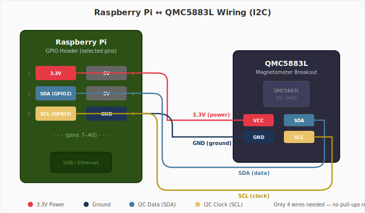

# Getting Started

This guide walks you through installing gas2mqtt, connecting the QMC5883L sensor, and
verifying that data flows to your MQTT broker.

## Prerequisites

| Requirement       | Details                                              |
| ----------------- | ---------------------------------------------------- |
| **Raspberry Pi**  | Any model with I2C (Pi 3/4/5 or Zero 2 W)           |
| **QMC5883L**      | 3-axis magnetometer breakout board (I2C, 0x0D)       |
| **MQTT broker**   | Mosquitto, EMQX, or any MQTT 3.1.1+ broker          |
| **Python**        | 3.14+ (Docker image includes this)                   |

### Wiring

Connect the QMC5883L to the Raspberry Pi I2C pins:

| QMC5883L | Raspberry Pi     |
| -------- | ---------------- |
| VCC      | 3.3V (pin 1)    |
| GND      | GND (pin 6)     |
| SDA      | GPIO 2 (pin 3)  |
| SCL      | GPIO 3 (pin 5)  |

<figure markdown="span">
  { width="680" }
  <figcaption>Four-wire I2C connection — no external pull-up resistors needed (the breakout board includes them).</figcaption>
</figure>

!!! tip "Enable I2C"
    Run `sudo raspi-config` → **Interface Options** → **I2C** → **Enable**, then reboot.
    Verify with `i2cdetect -y 1` — you should see `0d` in the output.

---

## Installation

=== "Docker (recommended)"

    Docker is the simplest way to run gas2mqtt. The provided `docker-compose.yml`
    maps the I2C device and includes a Mosquitto broker.

    ```bash
    # Clone and configure
    git clone https://github.com/ff-fab/gas2mqtt.git
    cd gas2mqtt
    cp .env.example .env
    # Edit .env with your MQTT broker and sensor settings
    ```

    ```bash
    # Start gas2mqtt + Mosquitto
    docker compose up -d
    ```

    The container needs I2C host access (`/dev/i2c-1`), which `docker-compose.yml`
    maps automatically.

    !!! note "Custom I2C bus"
        If your sensor is on a different bus (e.g., `/dev/i2c-0`), update both the
        device mapping in `docker-compose.yml` and `GAS2MQTT_I2C_BUS` in `.env`.

=== "Manual (pip/uv)"

    Install gas2mqtt directly on your Pi:

    ```bash
    pip install gas2mqtt
    # or with uv:
    uv pip install gas2mqtt
    ```

    Create a `.env` file or set environment variables, then run:

    ```bash
    gas2mqtt
    ```

    gas2mqtt reads `.env` from the current directory by default.

---

## First Run Verification

Once gas2mqtt is running, verify data is flowing by subscribing to the MQTT topics.

### Check Status

```bash
mosquitto_sub -h localhost -t "gas2mqtt/#" -v
```

You should see messages on these topics within the first minute:

| Topic                               | What it means                      |
| ----------------------------------- | ---------------------------------- |
| `gas2mqtt/status`                   | Heartbeat — the app is alive       |
| `gas2mqtt/gas_counter/availability` | `"online"` — gas counter is ready  |
| `gas2mqtt/temperature/availability` | `"online"` — temperature is ready  |
| `gas2mqtt/gas_counter/state`        | Initial state (counter = 0)        |
| `gas2mqtt/temperature/state`        | First temperature reading          |

### Verify a Gas Tick

Move a magnet near the sensor. You should see `gas2mqtt/gas_counter/state` update
with an incremented counter and the trigger changing between `"OPEN"` and `"CLOSED"`.

!!! warning "No messages?"
    - Confirm the broker is reachable: `mosquitto_pub -h localhost -t test -m hello`
    - Check gas2mqtt logs: `docker compose logs gas2mqtt` or the terminal output
    - Verify I2C: `i2cdetect -y 1` should show `0d`

---

## Next Steps

- [Configure](configuration.md) thresholds, intervals, and consumption tracking
- [MQTT Topics](mqtt-topics.md) — full topic reference with payload schemas
- [Architecture](architecture.md) — understand how gas2mqtt works internally
